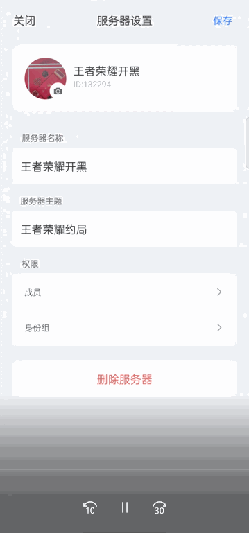
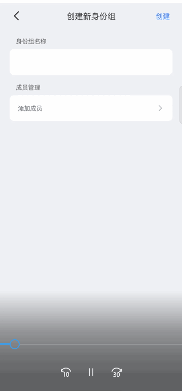
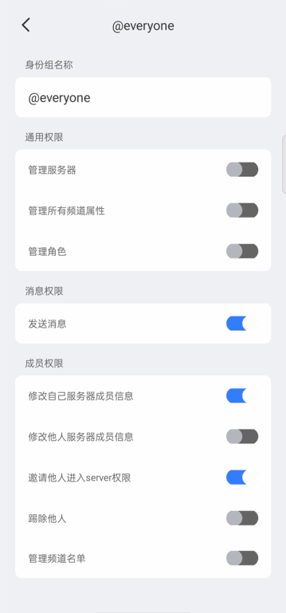
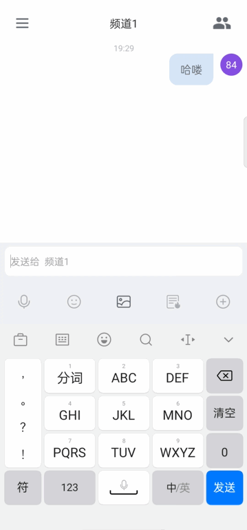
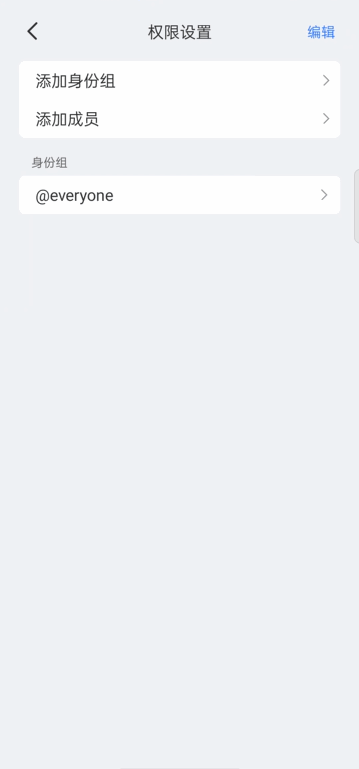

**概述**

网易云信圈组 Demo (演示 App) 及源码如下，您可以在 Android 和 iOS 平台中下载安装或直接打开对应 App，快速体验网易云信圈组的产品能力。

您也可以参考 Demo 源码，在您的本地项目中快速构建“类Discord即时通讯社群”应用。

**获取 Demo 及其源码**

| **Android**                       | **iOS**                       |
| --------------------------------- | ----------------------------- |
| Android二维码图片                 | iOS二维码图片                 |
| Android Demo的源码 （设置为链接） | iOS Demo的源码 （设置为链接） |

**主要概念**

体验Demo前，建议您先了解如下三个与圈组相关的核心概念。

**圈组服务器**

圈组服务器（Server）并非传统意义上的服务器，它是社群本身。所有的内容、兴趣、话题、关系都是以此为基础进行发展的。在圈组的场景下，任何行为的开始前都应该先创建一个圈组服务器。当用户开始邀请朋友时，是以圈组服务器的维度去发起邀请的。也就是说，用户的朋友加入的是圈组服务器。它是关系的集合。

**频道**

频道（Channel）是社群里的话题承载者。所有频道都要在圈组服务器下创建。 只有圈组服务器的成员才有可能访问该服务器的频道。

频道分为公开频道和私密频道。

- 公开频道：任意圈组服务器成员都能看到公开频道。支持配置黑名单控制访问权限。黑名单支持配置身份组所有成员或单个成员。
- 私密频道：对任意圈组服务器成员都不可见。支持配置白名单，控制对谁可见。白名单支持配置所有身份组成员和单个成员。

**身份组**

身份组是权限管理系统，核心目的是管理成员权限。

身份组分为两类，具体见下表：

| 分类          | 说明                                                         |
| ------------- | ------------------------------------------------------------ |
| @所有人身份组 | 在用户创建圈组服务器时默认创建。所有圈组服务器成员默认为@所有人身份组的成员。该身份组不可删除。每一个 appkey 的@所有人身份组的权限都会有初始默认值（默认开启或关闭）。如默认关闭，用户可手动开启。具体权限信息见圈组服务器下@所有人身份组的权限和频道下@所有人身份组的权限。 |
| 自定义身份组  | 需要用户主动创建。创建时会要求键入一些属性，如名称等。属性详情请参见身份组属性 。创建后需要创建者手动将服务器成员加入自定义身份组。 |

**Demo 已实现的功能**

目前圈组 Demo 已实现的功能如下：

| **功能大类**                                                 | **功能项**                                                   | **子功能**                                                   |
| ------------------------------------------------------------ | ------------------------------------------------------------ | ------------------------------------------------------------ |
| 圈组服务器管理                                               | 创建服务器                                                   | 从手机相册上传或拍摄服务器头像。                             |
| 创建服务器名称。                                             |                                                              |                                                              |
| 创建成功后在该服务器下默认创建两个频道（频道1和频道2），并自动进入频道1。 |                                                              |                                                              |
| 申请加入别人的服务器                                         | 根据服务器ID搜索目标服务器。                                 |                                                              |
| 申请人成功加入后默认进入该服务器下的频道1。                  |                                                              |                                                              |
| 删除服务器                                                   | 无                                                           |                                                              |
| 服务器成员管理                                               | 邀请成员                                                     |                                                              |
| 踢出成员                                                     |                                                              |                                                              |
| 圈组服务器设置                                               | 换服务器头像                                                 | 无                                                           |
| 权限管理                                                     | 创建服务器时默认创建“@所有人”身份组，该身份组定义了服务器所有成员的默认权限。 |                                                              |
| 新建自定义身份组管理权限，可设置身份组名称和添加成员。       |                                                              |                                                              |
| 自定义身份组排序。                                           |                                                              |                                                              |
| 编辑身份组时可开启/关闭如下**通用权限**：管理服务器管理所有频道属性管理角色 |                                                              |                                                              |
| 编辑身份组时可开启/关闭如下**消息权限**：发送消息所有频道中删除他人消息 |                                                              |                                                              |
| 编辑身份组时可开启/关闭如下**成员权限**：修改自己服务器成员信息修改他人服务器成员信息邀请他人进入Server踢除他人管理频道名单 |                                                              |                                                              |
| 频道管理                                                     | 创建频道                                                     | 创建频道时可设置频道名称、频道主题和频道类型（私密或公开）。 |
| 频道成员显示                                                 | 显示在线成员和离线成员。                                     |                                                              |
| 显示成员昵称或成员账号名称。                                 |                                                              |                                                              |
| 删除频道                                                     | 无                                                           |                                                              |
| 频道设置                                                     | 编辑频道名称和主题                                           | 无                                                           |
| 频道黑白名单管理                                             | 私密频道可设置白名单，控制可访问私密频道的人员。             |                                                              |
| 公开频道可设置黑名单，限制特定人员访问。                     |                                                              |                                                              |
| 频道权限管理                                                 | 通过添加身份组并设置身份组权限来设置频道成员权限，也可删除身份组。 |                                                              |
| 通过添加成员并为成员设置成员专属权限，可开启/关闭的权限包括“管理频道属性”、“”管理频道权限“、“发送消息”和“管理频道名单”。 |                                                              |                                                              |
| 消息收发                                                     | 发送文字或图片消息                                           | 无                                                           |
| 接收文字或图片消息                                           | 无                                                           |                                                              |
| 通讯录管理                                                   | 添加人员至通讯录                                             | 无                                                           |
| 删除通讯录人员                                               | 无                                                           |                                                              |
| 编辑通讯录人员信息                                           | 无                                                           |                                                              |
| 通讯录黑名单管理                                             | 无                                                           |                                                              |

**Demo 效果展示**

以下为部分 Demo 已实现功能的动图展示。

    

        
<b>创建圈组服务器</b>

        
    

    

        
<b>邀请好友加入服务器</b>

        
    

    

        
<b>创建身份组</b>

        
    

    

        
<b>身份组权限设置</b>

        
    

    

        
<b>发送消息</b>

        
    

    

        
<b>设置频道权限</b>

        
    

